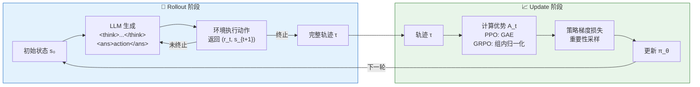
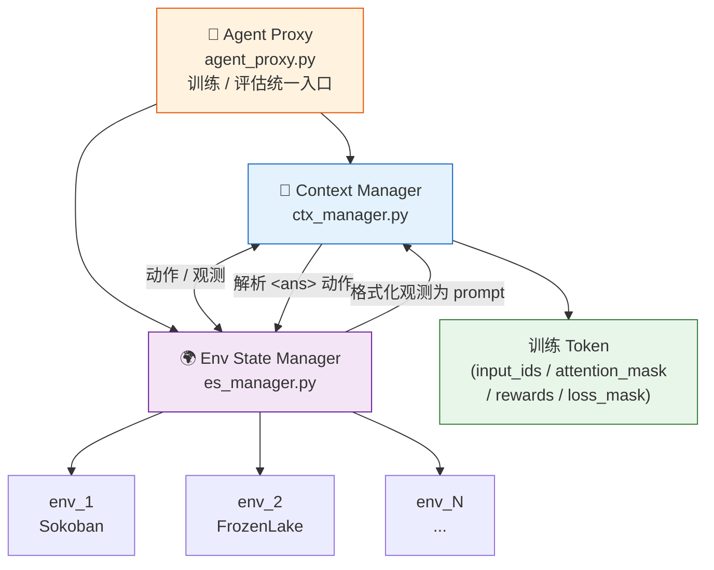
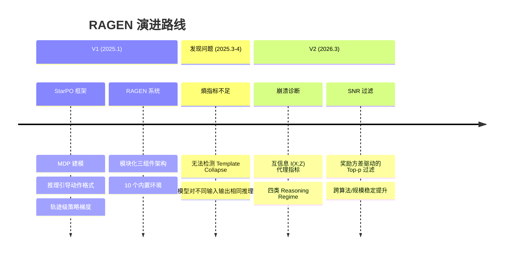

# RAGEN V1 论文笔记

!!! abstract "论文信息"
    **标题：** RAGEN: Understanding Self-Evolution in LLM Agents via Multi-Turn Reinforcement Learning  
    **arXiv：** [2504.20073](https://arxiv.org/abs/2504.20073)  
    **代码：** [RAGEN-AI/RAGEN](https://github.com/RAGEN-AI/RAGEN)  
    **作者：** Zihan Wang, Kangrui Wang, Qineng Wang, Pingyue Zhang, Linjie Li 等  
    **机构：** Northwestern University / Stanford / Microsoft Research 等  
    **笔记日期：** 2026-06-04

---

## 一、研究背景与动机

### 问题出发点

RL + 规则奖励（如 GRPO、PPO）在静态单轮任务（数学推理、代码生成）上已经验证有效，但直接迁移到**多轮 Agent 场景**存在两个本质困难：

1. **多轮交互（Multi-turn Interaction）：** Agent 需要根据环境反馈连续决策，动作之间有时序依赖，无法按单轮处理。
2. **随机性环境（Stochastic Environment）：** 相同动作可能导致不同结果（如 FrozenLake 的随机滑动），奖励信号噪声大。

已有方法（如 DeepSeek-R1、TinyZero）针对单轮静态任务设计，缺乏对多轮轨迹和随机环境的统一支持。

!!! note "核心研究问题"
    如何将 RL 训练机制从单轮静态任务推广到**多轮、随机、交互式 Agent 场景**，并让模型同时学会「推理」和「行动」？

---

## 二、核心贡献

!!! tip "三大贡献"
    1. **StarPO 算法框架**：将多轮 Agent 交互统一为轨迹级 RL 优化
    2. **RAGEN 系统**：基于 StarPO 的完整训练与评估系统，含 10 个内置环境
    3. **训练动态分析**：系统研究奖励归一化、上下文窗口、KL 惩罚对训练的影响

---

## 三、算法：StarPO

### 3.0 StarPO 整体流程



### 3.1 MDP 建模

将 Agent-环境交互形式化为**马尔可夫决策过程（MDP）**：

| 符号 | 含义 |
|------|------|
| $s_t$ | 当前环境观测（token 序列） |
| $a_t$ | 模型输出的 token 序列 |
| $T(s_{t+1} \| s_t, a_t)$ | 环境状态转移（可随机） |
| $r_t$ | 环境反馈的标量奖励 |
| 目标 | 最大化 $\mathbb{E}\left[\sum_t r_t\right]$ |

!!! note "与传统 RL 的关键区别"
    状态和动作都是 **token 序列**，而非低维向量，LLM 直接充当策略网络 $\pi_\theta$。

### 3.2 推理引导的动作格式

模型在每一步输出固定格式：

```
<think> 推理过程 </think> <ans> 动作 </ans>
```

- `<think>` 部分：链式推理，引导模型显式分析当前状态
- `<ans>` 部分：最终执行动作，传入环境

这种设计将「思考」和「行动」解耦，使 RL **同时优化推理质量和动作质量**。

### 3.3 StarPO 的两个阶段

**阶段一：Rollout（轨迹生成）**

给定初始状态 $s_0$，LLM 生成多条完整轨迹：

$$\tau = (s_0, a_0, r_0, s_1, a_1, r_1, \ldots, s_T, a_T, r_T)$$

**阶段二：Update（轨迹优化）**

用重要性采样对**完整轨迹**做策略梯度优化：

$$\mathcal{L}(\theta) = -\mathbb{E}_\tau \left[ \sum_t A_t \cdot \log \pi_\theta(a_t | s_{0:t}) \right]$$

优势 $A_t$ 支持两种估计后端：

| 后端 | 优势估计 | 特点 |
|------|---------|------|
| **PPO** | GAE（广义优势估计），使用 Critic 网络 | Token 级精细估计，训练更稳定 |
| **GRPO** | 组内归一化奖励，无需 Critic | 计算更简单，但方差较大 |

---

## 四、RAGEN 系统架构



| 模块 | 职责 |
|------|------|
| **Env State Manager** | 管理并行环境实例；执行 `step()`/`reset()`；批量处理动作并返回观测 |
| **Context Manager** | 解析动作；格式化观测为 prompt；管理历史上下文窗口；整合轨迹为训练 token |
| **Agent Proxy** | 统一 rollout 执行接口；协调 LLM 推理（vLLM）与环境交互 |

!!! tip "上下文窗口管理"
    通过 `max_context_window` 控制模型能看到的历史轮数：
    
    - `-1`（默认）：保留完整历史
    - `1`：无历史，退化为单轮
    - `k`：保留最近 k 轮

---

## 五、实验设置

### 实验环境

| 环境 | 类型 | 特点 |
|------|------|------|
| **Sokoban** | 空间推理 | 多步规划，确定性 |
| **FrozenLake** | 导航 | 随机滑动，需鲁棒策略 |
| **Bandit** | 探索 | 纯探索-利用权衡 |
| **Spatial** | 空间关系 | 语言描述的空间推理 |

### 基础模型与超参数

- 基础模型：**Qwen2.5-0.5B-Instruct**（验证）和 **Qwen2.5-3B-Instruct**（主要实验）
- 无 KL 惩罚（`kl_coef=0`）
- 仅保留成功轨迹的 top 25%

---

## 六、主要实验结论

!!! success "结论 1：StarPO 能有效训练多轮 Agent"
    在 Sokoban、FrozenLake、Bandit 任务上，从 Qwen2.5-0.5B 出发，StarPO 训练后 reward 持续上升。

!!! success "结论 2：推理引导有效"
    `<think>` 格式使模型显式分析环境状态，尤其在需要多步规划的 Sokoban 上效果明显。

!!! success "结论 3：泛化能力"
    在简单 Sokoban（6×6，1 box）训练后，能泛化到：更大地图（8×8，2 boxes）、不同符号表示、FrozenLake 等其他环境。

!!! success "结论 4：PPO 比 GRPO 更稳定"
    多个来源（Open-Reasoner-Zero、TinyZero）和自身实验均发现 PPO（GAE）在 Agent 训练中更稳定，后续版本默认切换为 PPO。

---

## 七、局限性与遗留问题

!!! warning "已知局限"
    1. **奖励设计依赖领域知识：** 不同环境需要手动设计奖励函数。
    2. **Template Collapse 未被检测：** 熵指标无法发现模型对不同输入输出相同推理模板的问题，这成为 V2 的核心研究对象。
    3. **复杂环境扩展性：** WebShop 等真实环境集成较繁琐。
    4. **分布式训练：** V1 主要在单节点多 GPU 上验证。

---

## 八、与 RAGEN V2 的关系



| 维度 | V1 | V2 |
|------|----|----|
| 核心算法 | StarPO 框架建立 | SNR-Adaptive Filtering |
| 诊断工具 | 熵监测 | 互信息（MI）+ 四类 reasoning regime |
| 发现的新问题 | — | Template Collapse（熵盲区）|
| 训练干预 | 轨迹过滤（top 25%） | 奖励方差过滤（Top-p）|

V2 的核心动机直接来自 V1 的遗留问题：熵指标不足以诊断训练质量。

---

## 九、核心思想总结

!!! abstract "一句话总结"
    StarPO 将多轮 Agent 的「推理-行动-奖励」统一建模为轨迹级 MDP，用重要性采样做端到端优化，让 LLM 同时学会在随机交互环境中推理和决策。

```
单轮 RL（GRPO/PPO）
    ↓ 挑战：多轮 + 随机环境
StarPO = MDP 建模 + 推理引导动作格式 + 轨迹级策略梯度
    ↓ 实现
RAGEN = StarPO + 模块化系统（ESM + CTX + AP）+ 多环境支持
    ↓ 发现
PPO 比 GRPO 更稳定；推理引导有效；训练质量监测不足（→ V2）
```

---

## 十、引用

```bibtex
@misc{ragen,
  title={RAGEN: Understanding Self-Evolution in LLM Agents via Multi-Turn Reinforcement Learning},
  author={Zihan Wang and Kangrui Wang and Qineng Wang and Pingyue Zhang and Linjie Li and
          Zhengyuan Yang and Xing Jin and Kefan Yu and Minh Nhat Nguyen and Licheng Liu and
          Eli Gottlieb and Yiping Lu and Kyunghyun Cho and Jiajun Wu and Li Fei-Fei and
          Lijuan Wang and Yejin Choi and Manling Li},
  year={2025},
  eprint={2504.20073},
  archivePrefix={arXiv},
  primaryClass={cs.LG},
  url={https://arxiv.org/abs/2504.20073},
}
```
